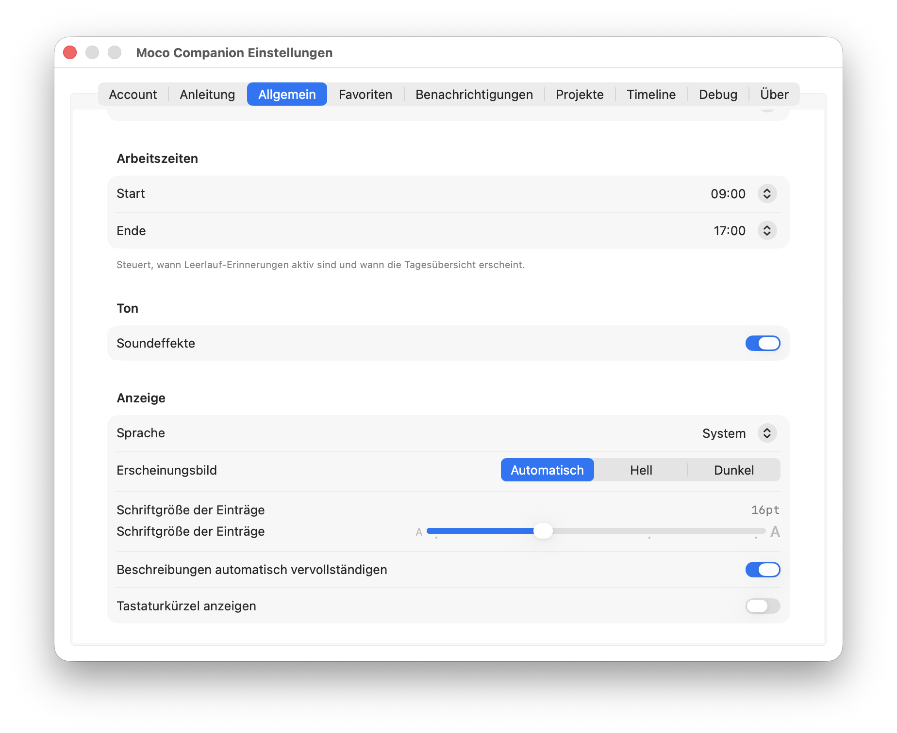
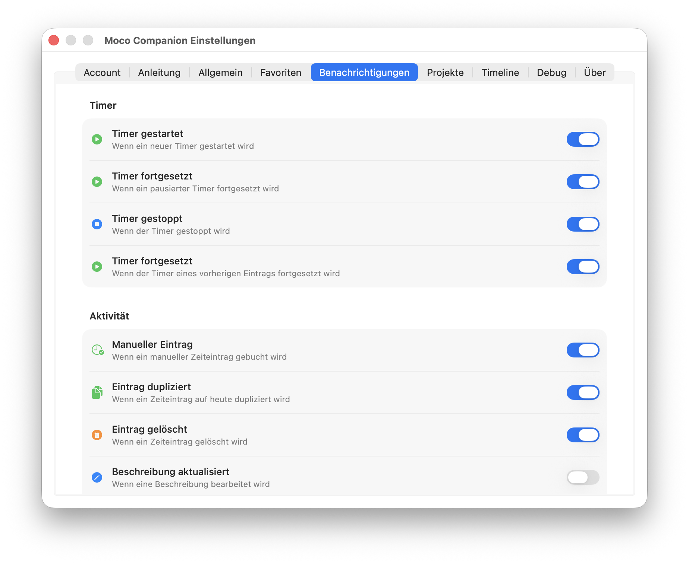

# Settings

Open via **right-click menubar → Settings** or `⌘,`.

Settings window (780×580) has 9 tabs:

## Account
- **Subdomain** — your Moco instance name (accepts full URLs, auto-extracts subdomain)
- **API Key** — stored in macOS Keychain (masked display)
- **Status** — connection indicator + Refresh Projects button

## How to Use
- **Global Shortcut** — current shortcut display + click-to-record custom shortcut
- **Track** — search, keyboard navigation, tagging reference
- **Log** — today/yesterday controls reference

All instructions are localized (German/English).

## General

- **Startup** — Launch at Login toggle, Default Tab picker (Track / Log)
- **Working Hours** — Start/End time pickers, working days selection. Controls when idle reminders are active and when the end-of-day summary appears.
- **Sound** — Sound Effects toggle (Tink on start, Pop on stop)
- **Display** — Appearance (Auto/Light/Dark), entry font size slider (15–18pt), Show Keyboard Hints toggle, Autocomplete Descriptions toggle
- **Language** — System / English / German

## Timeline
Three sections:

- **Calendar** — Enable calendar integration (requires macOS calendar permission)
- **Rules** — Enable autotracker rules, manage rule list (add/edit/delete/toggle individual rules), rule type icons
- **Tracking** — Track window titles toggle, excluded apps list with running-app picker

## Favorites
- **Show Favorites** toggle
- Reorder favorites via drag (☰ handles)
- Remove individual favorites (✕ button)

## Notifications

5 groups with per-type toggles:

| Group | Types |
|-------|-------|
| **Timer** | Started, Resumed, Stopped, Continued |
| **Activity** | Manual Entry, Duplicated, Deleted, Description Updated, Projects Synced |
| **Reminders** | Idle (5min no timer), Forgotten Timer (3h+), End of Day Summary |
| **Budget** | Project Budget Warning, Task Budget Warning |
| **Alerts** | Yesterday Incomplete, API Errors (always on) |

## Projects
- Browse synced projects with customer names and active tasks
- Refresh button for manual re-sync

## Debug
- **Demo Mode** — use sample data for screenshots (requires restart)
- Log levels (API, App) — adjustable verbosity
- Open/reveal/clear log files

## About
- App icon, name, and version number
- Author name (Volker Otto)
- License (MIT)
- Link to GitHub repository

---

Next: [Keyboard Shortcuts](keyboard-shortcuts.md)
