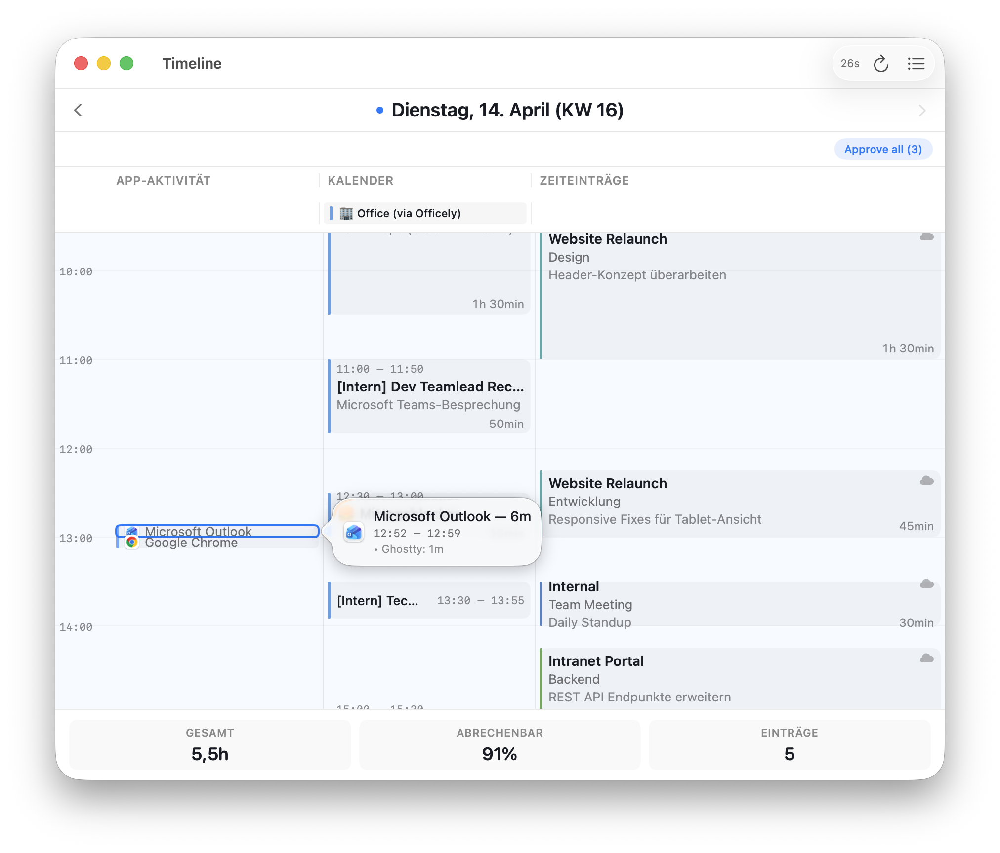
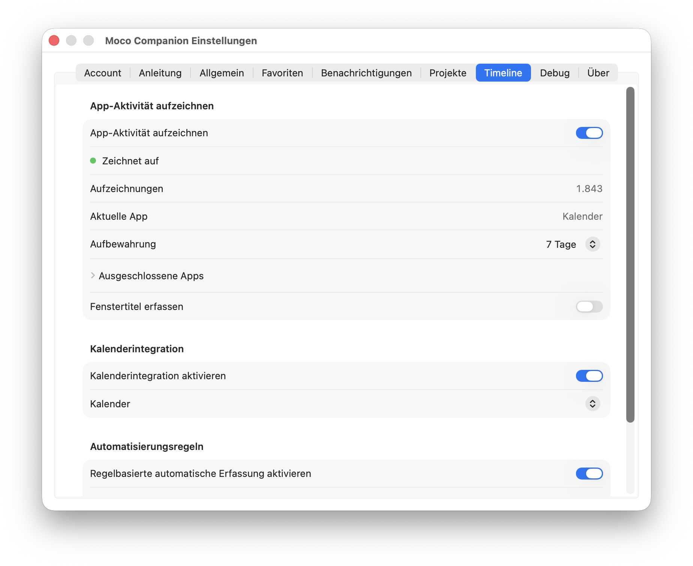
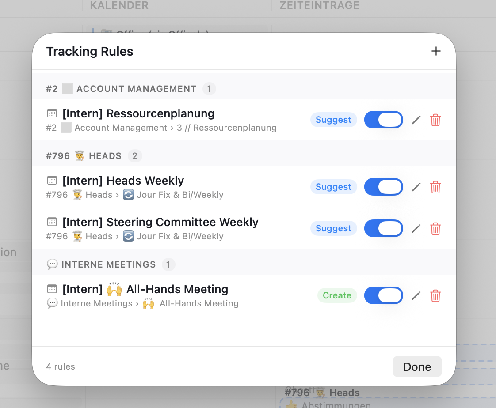
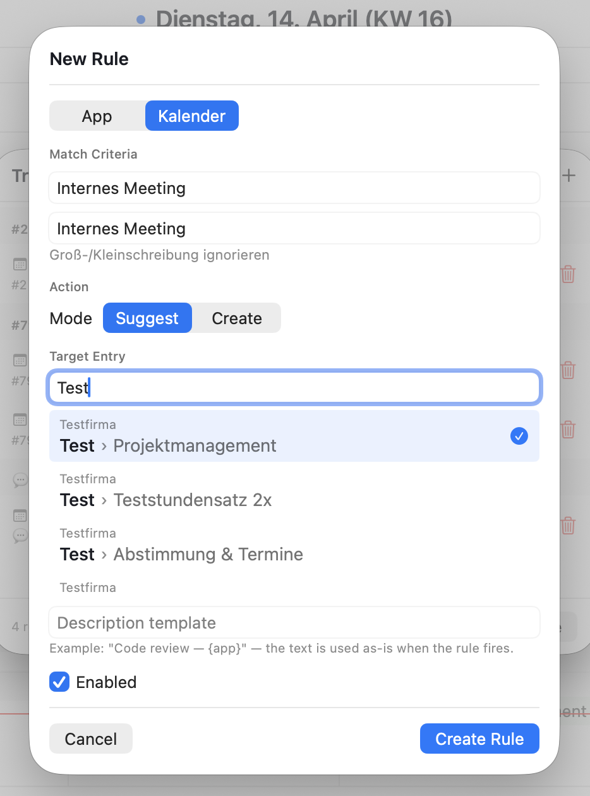

# Timeline & Autotracker

## The Timeline View

Open the Timeline via `⌘T` from the quick-entry panel or via the menubar context menu.

The Timeline shows your workday as a visual time axis with two columns side by side:

- **Left column — App usage** shows which applications you used and for how long, rendered as colored blocks. Blocks are clustered when they overlap so nothing is hidden.
- **Right column — Moco entries** shows your tracked time entries positioned on the same time axis, color-coded by project (colors synced from Moco).

Above the timeline, an **all-day events bar** shows calendar events that span the full day (holidays, out-of-office, etc.).

### Creating entries on the timeline

- **Drag in empty space** in the Moco column to create a new entry. A ghost preview shows the time range as you drag. Dragging bottom-to-top works too.
- **Move entries** by dragging an existing block up or down on the time axis.
- **Resize entries** by dragging the top or bottom edge of a block.
- Changes are pushed to Moco immediately after move or resize.

### Managing entries

- **Click** an entry to select it. The selected entry is highlighted.
- **Delete/Backspace** removes the selected shadow entry (with confirmation).
- **Right-click** an entry for a context menu with edit and delete options.
- Billed entries are read-only — they cannot be moved, resized, or deleted.

The toolbar shows the current date, a sync button with last-sync timestamp, and navigation to switch days.

---

## Autotracker

The Autotracker runs in the background and records which apps you use throughout the day. It captures:

- **App name and bundle ID** for each focused application
- **Window titles** (optional, enable in Settings → Timeline → Track window titles)
- **Duration** of each usage session

Usage blocks shorter than 5 minutes are filtered out to reduce noise.

When you see app usage blocks on the timeline, you can:

1. **Right-click an app block** → "Create entry" to turn it into a Moco time entry with the matching time range
2. **Approve a suggestion** — when a rule matches an app block, a dashed-outline suggestion appears. Hover to see details, click to approve and create the entry.

**Excluded apps:** In Settings → Timeline → Excluded Apps, you can blacklist apps that should not be tracked (e.g., your password manager). Uses a running-app picker for easy selection.

---

## Calendar Integration

When calendar access is granted (macOS will prompt on first use), your calendar events appear on the timeline:

- **Timed events** show as blocks in the calendar column, positioned on the time axis
- **All-day events** appear in a dedicated bar above the timeline
- Events are read-only — they serve as context for your time entries, not as editable items

Calendar events are also available as triggers for autotracker rules (see below).

---

## Rules

Rules let you automate time entry creation based on app usage or calendar events.

### Creating a rule

1. Open Settings → Timeline → Rules, or right-click an app block on the timeline → "Create rule"
2. Choose a **rule type**: App-based or Calendar event-based
3. For app rules: select the app (auto-filled from context menu) and optionally a window title pattern
4. For calendar rules: enter an event title pattern to match
5. Select the **project and task** the rule should map to
6. Save — the rule takes effect on the next autotracker evaluation cycle

### Managing rules

- Rules are listed in Settings → Timeline with toggle switches to enable/disable each one
- Each rule shows its type icon, match criteria, and target project
- Edit or delete rules from the list
- Rules are evaluated during the periodic background tick (every 10 minutes)

---

Next: [Settings](settings.md)
