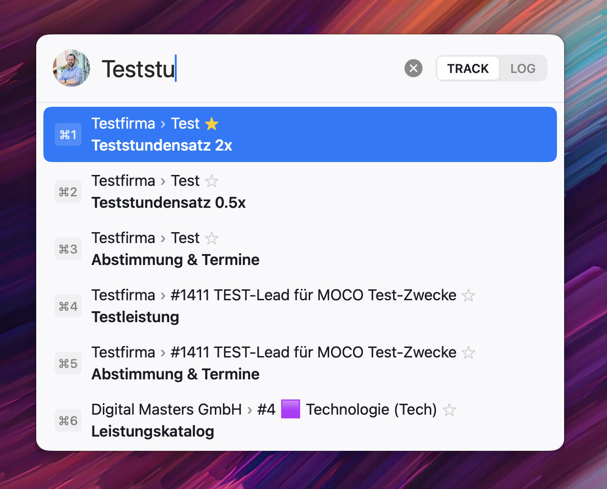
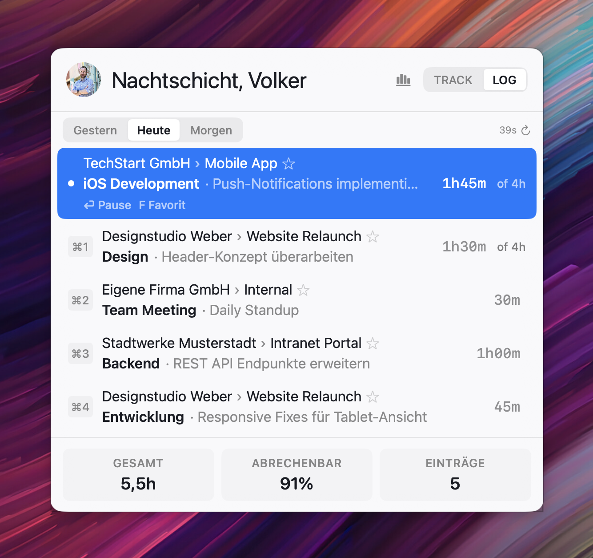
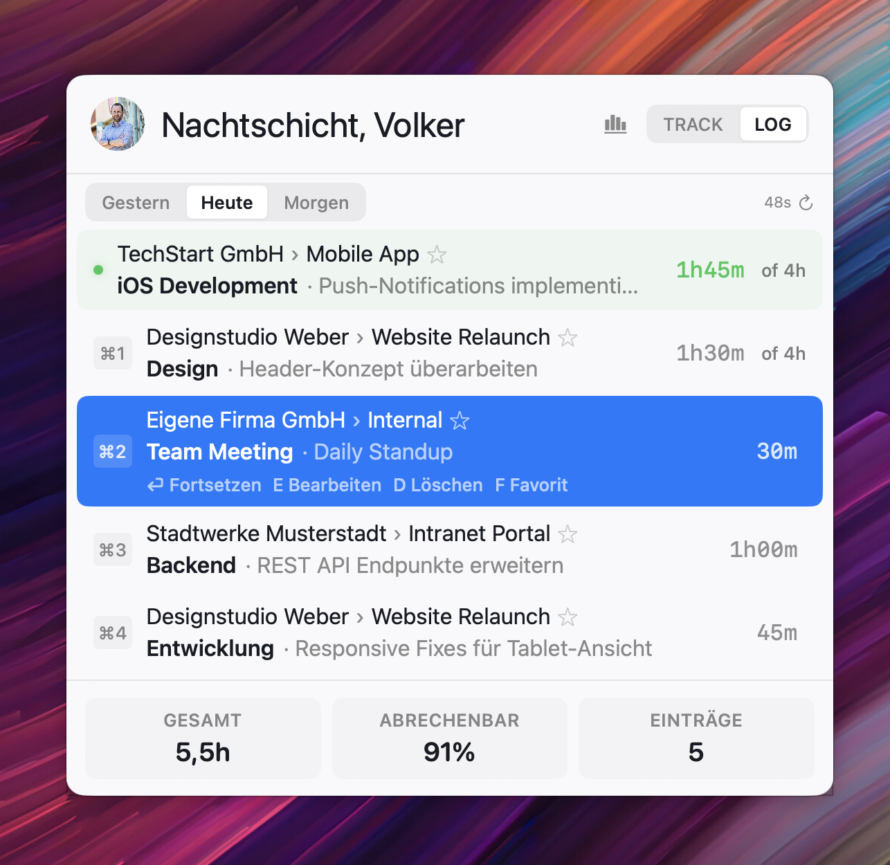

# Your Workday with MocoCompanion

## Morning: Start Your Day

### 1. Open the Panel

Press your **global shortcut** (`⌘⌃⌥M` by default) or **left-click** the menubar icon.

The panel opens with two tabs: **TRACK** and **LOG**. Which tab appears first is configurable in Settings → General → Default Tab.

Your user avatar (or initials) appears in the top-left of both views.

### 2. Check What's Planned

Switch to the **LOG** tab (press `Tab` or click the tab switcher).

You'll see the day toggle: **Gestern | Heute | Morgen** (Yesterday | Today | Tomorrow). Today shows:

- **Tracked entries** — any time already booked today
- **Planned · not yet tracked** — tasks from Moco's planning that you haven't started
- **Stats footer** — total hours, billable %, entry count

Each planned task shows the project name, task name, and planned hours.

**To start working on a planned task:**
- Use `↓` arrow key to navigate to the planned task
- Press `Enter` to start the timer — or click the row
- The task moves from "Planned" to "Tracked"

### 3. Start from Favorites or Search

Switch to the **TRACK** tab. You'll see:

- **Favorites** — your pinned project/task combos (⭐ star to toggle)
- **Recents** — recently used combos with last description
- **Suggestions** — popular projects (when favorites and recents are empty)

**The search → timer flow:**
1. Type a few characters (e.g., `mark` to find "Marketing")
2. Results filter live — use `↑↓` or `⌘1`–`⌘5` to select
3. Press `Enter` → project/task locks in, you enter the **description phase**
4. A green checkmark banner shows your selection
5. Type a description (e.g., "Weekly sync call")
6. Press `Enter` → **timer starts**, panel closes, menubar updates

**In the description phase:**
- Use `#TICKET-123` in your description — extracted as a tag automatically
- `Tab` autocompletes from your previous descriptions
- Toggle **Timer / Manual** to switch between timer start and hours booking
- `Escape` goes back to search

---

## Mid-Morning: Switch Tasks

### Option A: Quick Switch via Search

1. Press `⌘⌃⌥M` to open the panel
2. Search for the new project/task → select → describe → `Enter`
3. The **previous timer stops automatically** and the new one starts

### Option B: Continue a Previous Entry from Today

1. Open panel → **LOG** tab → Today
2. Navigate to a previous entry with `↑↓`
3. Press `Enter` → timer continues on that entry, panel closes

### Option C: Quick-Start with ⌘+Number

In the **LOG** tab, each entry has a ⌘-number badge (⌘1, ⌘2, etc.):
- Press `⌘1` to instantly start tracking on the first entry
- Works in both Today and Yesterday views
- Panel closes after starting

---

## Break: Pause Timer

### Pause

1. Press `⌘⌃⌥M` to open the panel
2. With the search field empty, press `Enter` → **timer pauses**
3. The menubar dot changes to 🟠 orange, text disappears
4. **Panel stays open** so you can see the paused state

### Resume

1. Press `⌘⌃⌥M` again (or if panel is still open)
2. Press `Enter` with empty search → **timer resumes**
3. Menubar dot returns to 🟢 green with live elapsed time

Alternatively, in the Log tab: select the paused entry and press `Enter` to resume. The panel stays open when pausing, closes when resuming.

---

## Before Lunch: Review & Correct

### Check Your Day

Open panel → **LOG** tab → Today.

- **Running entry** — green dot, live elapsed time, listed first
- **Paused entry** — orange dot
- **Completed entries** — static duration (e.g., `1h05m`)
- **Planned hours** — entries show `1h of 2h` (tracked vs planned)

Stats footer shows: **Gesamt** (total hours), **Abrechenbar** (billable %), **Einträge** (entry count).

Press `⌘R` to manually sync with Moco at any time.

### Edit an Entry

1. Navigate with `↑↓`, press `E`
2. Edit overlay appears inline: description, hours, project reassignment
3. `Enter` to save, `Escape` to cancel

**Hours accept flexible formats:** `1`, `1.5`, `1h`, `60m`, `1h 30m`, `1,5`

### Change Project on an Entry

1. Press `E` to edit → click the project name in the header
2. Mini search field appears — type to filter projects
3. Select the correct project → task dropdown updates
4. `Enter` to save — description and hours preserved

### Delete an Entry

1. Navigate with `↑↓`, press `D`
2. Confirmation row: **Abbrechen (Esc)** and **Löschen (↩)** buttons
3. Both clickable and keyboard-accessible

### Check Yesterday

Press `←` arrow to switch to **Gestern** (Yesterday).

Yesterday's entries are fully editable (hours, description, project, task). Key differences from Today:

- **Enter** on a yesterday entry → **starts a new timer** with the same project/task/description (copies to today)
- **E** to edit, **D** to delete, **F** to favorite
- Active timer entries are hidden from the Yesterday view (they belong to Today)
- The Yesterday empty state shows "Keine Einträge gestern" (not Today's message)

---

## End of Day: Manual Entry

Forgot to track a meeting? Book it without starting a timer:

1. `⌘⌃⌥M` → search → select project/task → `Enter`
2. In the description phase, click **Timer / Manual** toggle (or press `Tab` to switch and focus hours)
3. Enter hours: `2` or `2h` or `1h 30m` or `90m`
4. Type description → `Enter` → entry booked, no timer started

---

## Check Tomorrow

Press `→` twice from Today (or once from Yesterday's Tomorrow) to see **Morgen** (Tomorrow).

Tomorrow shows a read-only planning view:
- Planned tasks with project/customer names and hours
- Total planned hours at the bottom
- Absence banners if you have scheduled leave

---

Next: [Timeline & Autotracker](timeline.md)
